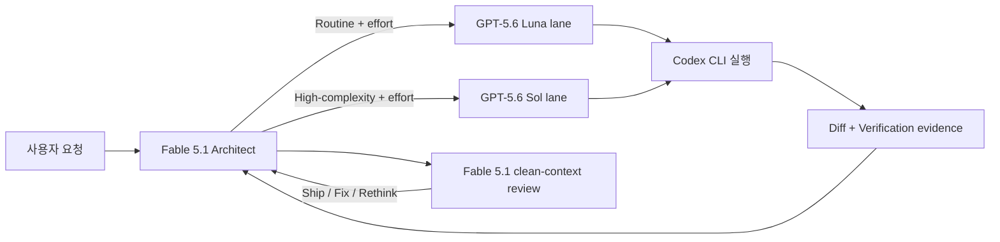

# fable-advisor-k 프로젝트 개선 분석 보고서

- 분석일: 2026-09-03
- 분석 대상: `main` 브랜치 `1168193`
- 분석 범위: 플러그인 메타데이터, agent/skill 정의, 실행 레시피, 사용자 문서, 릴리스·운영 절차

## 1. 결론 요약

`fable-advisor-k`는 일반 애플리케이션이 아니라 **Markdown으로 동작 계약을 선언하는 Claude Code 플러그인**이다. 핵심 구조는 명확하다.

1. Fable 5.1이 요구사항과 작업 경계를 설계한다.
2. GPT-5.6 Luna가 일반 구현을 수행한다.
3. GPT-5.6 Sol이 판단 비용이 큰 작업을 수행한다.
4. 구현 결과는 실제 diff와 검증 명령으로 확인한다.
5. Fable 5.1이 architect가 실행한 검증 evidence와 실제 diff를 읽고 최종 출고 여부를 다시 검토한다.

현재 문서와 메타데이터의 정합성은 양호하고, timeout·resume·빈 diff 감지 같은 운영 원칙도 구체적이다. 가장 큰 개선 여지는 기능 추가가 아니라 **문서 속 실행 계약을 더 결정적이고 검증 가능하게 만드는 것**이다.

분석 당시 우선순위와 현재 실행 상태는 다음과 같다.

| 순위 | 개선 항목 | 영향 | 예상 공수 | 상태 |
|---|---|---:|---:|---|
| P0 | Sol checkpoint 목표와 실제 cap 정합화 | 높음 | 매우 작음 | 완료 |
| P0 | unsupported effort의 `refused`/`unavailable` 충돌 해소 | 높음 | 매우 작음 | 완료 |
| P1 | 그 외 nonzero 종료의 보고 규칙 명확화 | 중간 | 작음 | 완료 |
| P2 | 임시 진단 파일의 보존·삭제 정책 명시 | 중간 | 작음 | 완료 |
| P2 | 선언 버전과 Git 태그 일치 | 중간 | 매우 작음 | 완료 |
| P2 | 선택적 저장소 validator와 레시피 드리프트 검사 | 낮음~중간 | 중간 | 완료 |

가장 먼저 처리한 일은 약 10분을 강제 종료 시간이 아닌 durable checkpoint 목표로 정의하고, 잘못된 effort를 `refused`로 통일하는 것이었다. 이후 nonzero 종료 규칙, artifact 수명 주기, validator, 회귀 테스트와 릴리스 태그를 반영했다.

---

## 2. 분석 방법과 확인 범위

### 확인한 구성

- 플러그인 메타데이터
  - `.claude-plugin/plugin.json`
  - `.claude-plugin/marketplace.json`
- 실행 및 검토 agent
  - `agents/codex-implementer.md`
  - `agents/sol-implementer.md`
  - `agents/fable-advisor.md`
- orchestration 정책
  - `skills/orchestration/SKILL.md`
- 사용자·유지보수 문서
  - `README.md`
  - `PATCHES-K.md`
- 저장소 운영 상태
  - Git 브랜치, 태그, 추적 파일, 작업 트리
  - 설치된 Claude Code와 Codex CLI 버전
  - Claude plugin manifest 검증

### 분석 시 실행한 검증

| 검증 | 결과 |
|---|---|
| `claude plugin validate .` | marketplace manifest 검증 통과 |
| Claude Code 버전 | `2.1.252` |
| Codex CLI 버전 | `0.152.1` |
| `git tag --points-at HEAD` | HEAD 대응 태그 없음 |
| `git describe --tags --always` | `v5.0.0-8-g1168193` |

이 저장소에는 애플리케이션 빌드나 테스트 엔트리포인트가 없다. 따라서 분석은 일반적인 단위 테스트 커버리지보다 **플러그인 계약, embedded shell 레시피, 릴리스 재현성**에 초점을 맞췄다.

---

## 3. 현재 아키텍처

### 역할 분리

- Architect는 요구사항, 인터페이스, 작업 분할, lane, reasoning effort, acceptance를 소유한다.
  - 근거: `skills/orchestration/SKILL.md:8`, `skills/orchestration/SKILL.md:20`, `skills/orchestration/SKILL.md:32`
- Routine lane은 `gpt-5.6-luna`, high-complexity lane은 `gpt-5.6-sol`을 명시적으로 선택한다.
  - 근거: `agents/codex-implementer.md:97-103`, `agents/sol-implementer.md:98-104`
- 구현 위임은 objective, files, interfaces, constraints, verification, reasoning의 여섯 항목을 요구한다.
  - 근거: `skills/orchestration/SKILL.md:57-68`
- 최종 완료 전 architect가 실행한 검증 evidence와 실제 diff를 기반으로 별도 Fable review를 요구한다. Advisor에는 Bash 도구가 없으므로 검증 명령을 직접 재실행하는 역할은 아니다.
  - 근거: `skills/orchestration/SKILL.md:88-90`, `skills/orchestration/SKILL.md:103-106`, `agents/fable-advisor.md:4-5`, `agents/fable-advisor.md:19`, `agents/fable-advisor.md:25`

### 상태 복구 모델

현재 설계는 비정상 결과를 원인별로 다르게 취급한다.

- `timeout`: 같은 lane에서 더 작은 조각으로 분할
- `unavailable`: 설치·인증·모델 접근 오류를 공개하고 다른 적절한 경로 판단
- `refused`: 충돌 정책 또는 잘못된 요청 수정
- `partial`: 이미 기록된 변경을 검증하고 나머지만 재위임

근거: `skills/orchestration/SKILL.md:34-39`

---

## 4. 잘 설계된 점

### 4.1 모델과 effort의 책임이 분리되어 있다

lane이 모델을 고정하고 architect가 작업별 reasoning effort를 결정한다. 전역 Codex 설정 때문에 routine lane이 의도치 않게 Sol로 바뀌는 문제를 예방한다.

- `agents/codex-implementer.md:36-42`
- `agents/sol-implementer.md:36-42`
- `PATCHES-K.md:68-80`

### 4.2 timeout을 모델 성능 문제가 아닌 작업 크기 신호로 본다

시간 초과 시 비싼 모델로 즉시 교체하지 않고 작업을 분할한다. 비용과 재현성 면에서 타당한 정책이다.

- `skills/orchestration/SKILL.md:35-37`
- `skills/orchestration/SKILL.md:70-78`

### 4.3 외부 kill 이전에 진단 정보를 남기려는 설계가 구체적이다

내부 cap, TERM→KILL, JSON 로그, session ID, 마지막 메시지를 이용해 outer Bash tool timeout보다 먼저 결과를 분류하려 한다.

- `agents/codex-implementer.md:77-111`
- `agents/sol-implementer.md:78-112`

### 4.4 resume 대상 선택이 안전하다

`thread.started`의 `thread_id`를 사용하고, 동시 실행 중 잘못된 세션을 잡을 수 있는 `resume --last`를 최후 수단으로 제한한다.

- `agents/codex-implementer.md:109-130`
- `agents/sol-implementer.md:110-131`

### 4.5 성공 판정이 모델의 자기 보고에 의존하지 않는다

프로세스가 0으로 끝나도 요청한 diff가 비어 있으면 성공이 아니라 `refused`로 처리하고, wrapper가 diff와 검증을 다시 확인한다.

- `agents/codex-implementer.md:145-155`
- `agents/sol-implementer.md:148-157`
- `skills/orchestration/SKILL.md:103-106`

---

## 5. 상세 개선 권고

이 절의 “확인된 사실”과 “위험”은 분석 대상 커밋 `1168193`의 구현 전 상태를 기록한다. 현재 상태는 각 “구현 결과”와 8절의 최종 평가를 기준으로 한다.

### P0-1. unsupported effort의 상태 충돌을 해소해야 한다

### 확인된 사실

- orchestration skill은 지원하지 않는 effort를 lane이 “refuses”한다고 설명한다.
  - `skills/orchestration/SKILL.md:53`
- 두 구현 lane은 같은 상황을 `STATUS: unavailable`로 보고하도록 지시한다.
  - `agents/codex-implementer.md:36-38`
  - `agents/sol-implementer.md:36-38`
- 실제 Shell 예시는 unsupported effort에서 `exit 2`를 반환한다.
  - `agents/codex-implementer.md:87-89`
  - `agents/sol-implementer.md:88-90`
- orchestration 정책에서 `unavailable`은 다른 적절한 경로로 재라우팅할 수 있지만, `refused`는 잘못된 요청을 수정해야 하는 상태다.
  - `skills/orchestration/SKILL.md:34-38`

### 위험

동일한 잘못된 effort 입력이 문서를 따르는 주체에 따라 다른 복구 전략으로 이어질 수 있다. `unavailable`로 해석하면 모델 접근 문제처럼 재라우팅할 수 있고, `refused`로 해석하면 architect가 spec을 고쳐야 한다.

이는 단순한 표현 차이가 아니라 다음 행동이 달라지는 실제 계약 충돌이다.

### 권고

unsupported effort는 모델 가용성 문제가 아니라 잘못된 spec이므로 `refused`로 통일하는 편이 원인별 복구 정책과 더 잘 맞는다.

- `skills/orchestration/SKILL.md`와 두 lane의 용어를 `refused`로 통일한다.
- `unavailable`은 설치, 인증, 모델 접근 실패에만 사용한다.
- Shell 예시가 `exit 2`로 끝나더라도 wrapper가 `STATUS: refused`와 지원 가능한 effort 목록을 반환하도록 문구를 연결한다.

### 수용 기준

1. skill과 두 lane이 동일한 상태명을 사용한다.
2. unsupported effort에서 다른 lane으로 자동 재라우팅하지 않는다.
3. report가 잘못된 값과 해당 lane의 지원 effort를 제시한다.

---

### P0-2. Sol checkpoint 목표와 실제 cap을 맞춰야 한다

### 분석 당시 확인된 사실

- 기본 `BASH_MAX_TIMEOUT_MS` fallback은 600,000ms이며 내부 cap은 60초를 뺀 540초, 즉 약 9분이다.
  - `agents/codex-implementer.md:18`
  - `agents/codex-implementer.md:82-84`
- 당시 문서는 Sol의 약 10분을 checkpoint가 아닌 권장 조각 크기처럼 표현했다.
  - `agents/sol-implementer.md:44-46`
  - `skills/orchestration/SKILL.md:74`
  - `README.md:23`
- 권장 설정은 최대 timeout을 1,800,000ms로 높이지만, 각 Bash tool call의 timeout도 같은 상한으로 별도 설정해야 한다.
  - `README.md:40-48`
  - `skills/orchestration/SKILL.md:80`
  - `agents/codex-implementer.md:18-21`

### 위험

구현 전 문구대로 10분을 조각 크기로 해석하면 기본 설정 사용자는 정상 범위라고 이해한 조각이 약 1분 먼저 종료될 수 있었다. 시간만 보고 기계적으로 자르면 schema와 consumer 또는 함수 구현 중간이 갈라지는 반대 위험도 있었다.

### 적용한 방식

- Sol의 “약 10분”을 첫 durable checkpoint 목표로 정의하고 강제 종료 시간과 분리했다.
- 시간보다 독립적으로 검증 가능한 논리적 경계를 우선한다.
- 권장 1,740초 내부 cap에서는 응집된 15~20분 조각을 허용한다.
- 기본 540초 내부 cap에서는 모든 조각을 그보다 충분히 짧게 유지한다.
- 레인별 timeout 엔진이나 새 spec field를 추가하지 말고 기존 preflight echo와 report에 계산된 cap을 남긴다.
- host의 실제 tool timeout은 프로세스 안에서 확인할 수 없으므로 caller가 일치시켜야 한다는 제한을 유지한다.

### 완료 확인

1. 10분은 조각 종료가 아닌 첫 checkpoint 목표로 모든 governing 문서에 동일하게 설명된다.
2. 권장 1,740초 cap과 기본 540초 cap에서 허용되는 조각 크기가 구분된다.
3. outer timeout과 inner cap이 다를 수 있다는 제한이 누락되지 않는다.

### 구현 결과

2026-09-03에 다음 기준으로 반영했다.

- 약 10분은 Sol 조각의 강제 종료 시간이 아니라 첫 durable checkpoint 목표다.
- 분할 여부는 시간보다 독립 검증 가능한 논리적 경계가 먼저 결정한다.
- 함수 중간, schema와 consumer 사이, 빌드·테스트할 수 없는 상태에서는 분할하지 않는다.
- 권장 1,740초 내부 cap에서는 응집된 조각을 15~20분 유지할 수 있지만, 기본 540초 내부 cap에서는 그보다 충분히 짧아야 한다.

---

### P1-1. 그 외 nonzero 종료의 보고 규칙을 명확히 해야 한다

### 확인된 사실

- 종료 코드 124와 137은 이미 timeout으로 식별된다.
  - `agents/codex-implementer.md:108`
  - `agents/sol-implementer.md:109`
- timeout 후 변경이 있으면 `partial`, 없으면 `timeout`으로 보고하는 규칙이 이미 있다.
  - `agents/codex-implementer.md:146`
  - `agents/sol-implementer.md:148`
- 빈 requested diff는 이미 `refused`이며, architect는 실제 diff와 verification을 다시 확인해야 한다.
  - `agents/codex-implementer.md:152-153`
  - `agents/sol-implementer.md:154-155`
  - `skills/orchestration/SKILL.md:103-106`
- 반면 124·137 이외의 nonzero, `timeout` binary가 없는 상태에서의 outer kill, verification 실패의 report 상태는 표로 결정되어 있지 않다.
- report schema에는 `GAPS`가 있지만, empty-diff 규칙은 최종 메시지를 `REASON`에 넣으라고 지시한다.
  - `agents/codex-implementer.md:136-143`
  - `agents/codex-implementer.md:152`

### 위험

이것은 실행 가능한 state machine의 결함이라기보다 agent가 해석해야 하는 문서 계약의 빈틈이다. 대부분의 출고 gate는 이미 존재하지만, 드문 오류에서 report 표현이 달라질 수 있다.

### 권고

기존 다섯 상태를 유지하면서 최소 결정 규칙만 추가한다.

| 조건 | 보고 원칙 |
|---|---|
| 124·137, 검증된 변경 없음 | `timeout` |
| 124·137, 검증된 일부 변경 있음 | `partial` |
| 그 외 nonzero, 설치·인증·모델 접근 실패 | `unavailable` |
| 그 외 nonzero, 검증된 일부 변경 있음 | `partial` |
| verification 실패 | `partial`, 완료 주장 금지 |
| 원인 판별 불가 | 실제 RC와 로그 tail을 `GAPS`에 기록하고 `complete` 금지 |

별도 `REASON` field를 추가하기보다 현재 schema의 `GAPS`를 일관되게 사용한다.

---

### P2-1. 임시 진단 파일의 보존·삭제 정책이 필요하다

### 확인된 사실

두 lane은 `SPEC`, `FINAL`, `LOG`를 `mktemp`로 생성한다.

- `agents/codex-implementer.md:57-59`
- `agents/sol-implementer.md:57-59`

그러나 `trap`, `rm`, 파일 권한, 성공·실패별 보존 기준은 없다. README는 진단을 위해 로그와 마지막 메시지를 보존한다고 설명하지만 보존 기간과 위치를 사용자에게 반환하는 규칙은 없다.

### 위험

spec에는 파일 경로와 작업 문맥이, log에는 모델 출력과 오류가 포함된다. 반복 실행 시 temp 디렉터리에 민감할 수 있는 정보가 축적될 수 있다.

### 권고

- 성공 시 `SPEC`, `FINAL`, `LOG`를 삭제한다.
- 실패 시 필요한 최소 로그만 보존하고 report에 경로를 명시한다.
- README에 성공·실패별 보존 정책을 한 문단으로 추가한다.

복잡한 보존 daemon이나 별도 garbage collector는 이 프로젝트 규모에 비해 과하다.

---

### P2-2. `5.0.1` 릴리스를 재현 가능한 태그로 고정해야 한다

### 확인된 사실

- 플러그인 선언 버전은 `5.0.1`이다.
  - `.claude-plugin/plugin.json:3`
  - `PATCHES-K.md:5`
- 현재 HEAD를 가리키는 태그는 없다.
- `git describe --tags --always` 결과는 `v5.0.0-8-g1168193`이다.

### 위험

main 기반 설치는 동작하더라도, 사용자가 보고된 `5.0.1` 소스 상태를 나중에 동일하게 찾기 어렵다. upstream merge와 K-only patch가 계속되면 릴리스 경계가 더 모호해진다.

### 권고

검증 gate 통과 후 현재 릴리스 커밋에 annotated `v5.0.1` 태그를 만들고, 이후 validator가 다음을 확인하도록 한다.

- `plugin.json` 버전
- `PATCHES-K.md` current release
- 릴리스 태그

태그 생성과 원격 push는 명시적인 릴리스 작업으로 수행해야 한다.

---

### P2-3. 선택적 validator로 수동 검증과 드리프트를 보조한다

### 확인된 사실

`PATCHES-K.md:106`은 릴리스 전 marketplace 검증, JSON parsing, stale-reference 검색, live low-effort smoke test를 요구한다. 현재 저장소에는 별도 validator, test harness, CI workflow가 없다.

Luna와 Sol agent는 timeout, resume, session ID, report 처리의 대부분을 의도적으로 반복한다.

- `PATCHES-K.md:42-43`
- `agents/codex-implementer.md:77-143`
- `agents/sol-implementer.md:78-145`

두 agent가 architect 대화 문맥을 받지 않기 때문에 필요한 규칙을 각각 독립적으로 포함하는 것은 타당하다.

### 위험

현재 규모에서는 수동 검증도 가능하지만, upstream merge 후 버전·모델·effort·레시피 수정이 한쪽 파일에만 적용될 수 있다.

### 권고

공용 runtime이나 template generator를 먼저 도입하지 않는다. 다음 upstream 동기화 전에 작은 로컬 validator를 선택적으로 추가한다.

권장 검사는 다음으로 제한한다.

1. 두 JSON parse와 marketplace validation
2. agent/skill front matter 필수 field
3. `plugin.json`과 `PATCHES-K.md` 버전 일치
4. Luna/Sol 모델명과 effort 집합 일치
5. timeout, resume, refusal 핵심 sentinel parity
6. 제거된 `fable-implementer`가 활성 `agents/` 아래에 재등장하지 않는지 확인

README의 v4 수동 fallback 링크는 의도된 문서이므로 stale reference 오류로 처리하면 안 된다.

CI는 외부 기여나 upstream merge 빈도가 증가할 때 이 validator를 PR gate에 연결한다. 지금 즉시 CI 체계를 만드는 것은 이 12개 파일 규모의 선언형 플러그인에는 과할 수 있다.

다음 조건이 생길 때만 생성 방식을 검토한다.

- 같은 운영 수정이 세 번 이상 한쪽에 누락됨
- agent 수가 추가되어 반복 유지보수가 증가함
- Markdown snippet 자체를 자동 생성·배포하는 릴리스 파이프라인이 생김

---

## 6. 권장 실행 로드맵

### 단계 1: 사용자 영향이 있는 계약 충돌 해소 — 완료

예상 공수: 반나절 이하

- Sol 10분을 강제 종료 시간이 아닌 첫 durable checkpoint 목표로 명시
- 논리적 완결성과 독립 검증 가능한 경계를 시간보다 우선
- 권장 cap에서는 응집된 15~20분 조각 허용, 기본 cap에서는 540초보다 작게 유지
- unsupported effort를 `refused`로 통일하고 자동 재라우팅 금지

완료 결과: checkpoint·논리 경계·실제 cap의 관계가 모든 governing 문서에 일치하며, 같은 잘못된 effort가 문서마다 다른 복구 행동을 만들지 않는다.

### 단계 2: 나머지 오류 보고 규칙 보강 — 완료

예상 공수: 반나절 이하

- 124·137 이외의 nonzero 결과 분류
- verification 실패 시 `partial` 및 완료 금지
- 원인 불명 오류의 RC와 로그 tail을 `GAPS`에 기록
- 두 lane 문구를 함께 수정

완료 결과: 대표 nonzero 결과가 기존 다섯 상태 안에서 일관되게 보고되며, 원인 불명 종료는 재라우팅 전에 진단하도록 명시됐다.

### 단계 3: 운영 위생 — 완료

예상 공수: 반나절

- temp artifact 성공 시 정리, 실패 시 제한적 보존
- 실패 report에 보존 로그 경로 명시

완료 결과: 정상 실행은 모든 조각의 temp 파일을 정리하고, 그 외 상태의 report는 보존한 진단 파일 위치를 제공한다.

### 단계 4: 릴리스 재현성과 선택적 validator — 완료

예상 공수: 반나절

- 전체 검증 실행
- `v5.0.1` annotated tag 생성·push
- 작은 로컬 validator로 버전·front matter·lane parity 확인
- 유지보수 빈도가 높아질 때만 PR CI에 연결

완료 결과: `v5.0.1` 태그가 릴리스 커밋 `1168193`을 가리키며, 로컬 validator가 다음 upstream merge의 핵심 drift를 명령 하나로 확인한다.

### 단계 5: 정기 호환성 확인

예상 공수: 릴리스당 1회

- 지원 Claude Code/Codex CLI 버전 기록
- low-effort smoke test
- timeout, resume, 빈 diff 감지 결과 기록

모든 PR에서 유료 모델 smoke test를 실행하는 것은 비용과 flaky risk가 크므로 권장하지 않는다.

---

## 7. 권장하지 않는 과도한 개선

현재 규모에서는 다음 변경의 비용이 이득보다 클 가능성이 높다.

1. Luna/Sol 문서를 없애고 공용 runtime package로 전환
2. 모든 PR에서 실제 Codex 모델을 호출하는 E2E 테스트
3. 상태 종류를 계속 추가해 복구 모델을 복잡하게 만들기
4. timeout마다 자동으로 더 비싼 모델로 fallback
5. temp 파일 관리를 위한 별도 daemon 또는 서비스

프로젝트의 장점은 적은 파일과 명확한 선언형 계약이다. 개선도 이 특성을 유지하면서 **결정 규칙과 검증 가능성만 강화**하는 방향이어야 한다.

---

## 8. 최종 평가

아래 평가는 2026-09-03 개선 구현과 검증 완료 후의 상태다.

| 영역 | 평가 | 설명 |
|---|---|---|
| 아키텍처 명확성 | 좋음 | Architect, producer, reviewer 역할과 lane 선택 기준이 명확함 |
| 문서 품질 | 좋음 | 설치, 복구, upstream 동기화, 운영 배경이 상세함 |
| 실행 안정성 | 좋음 | 10분 checkpoint 의미, 실제 cap, effort·nonzero 상태와 resume spec 계약이 정합화됨 |
| 검증 자동화 | 좋음 | 로컬 validator와 24개 회귀 테스트가 핵심 machine-consumed 계약을 검사함 |
| 유지보수성 | 좋음 | 양쪽 lane은 독립성을 유지하면서 validator가 모델·effort·timeout·resume·artifact drift를 탐지함 |
| 보안·운영 위생 | 좋음 | 완료 시 전체 temp 파일을 삭제하고, 그 외 상태는 spec을 삭제한 뒤 진단 파일만 보고함 |
| 릴리스 재현성 | 좋음 | `v5.0.1` annotated tag가 릴리스 커밋 `1168193`을 고정함 |

종합적으로 우선 개선 항목은 구현과 검증을 마쳤다. 10분은 강제 분할 시간이 아니라 첫 durable checkpoint 목표이며, 논리적으로 분리하면 깨지는 작업은 권장 cap 안에서 완결성을 유지한다. 남은 선택 과제는 외부 기여나 upstream merge 빈도가 높아질 때 현재 validator를 CI에 연결하는 것이다.
